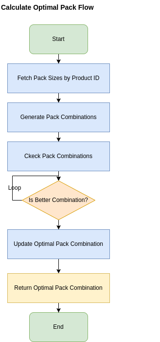

## Order Pack Calculator

This project is a solution to the RE Partners Software Engineering Challenge. It provides a flexible Golang-based HTTP API to calculate the optimal pack combination to fulfill a customer’s item order.

### Problem Statement

Given predefined pack sizes, determine how to fulfill an order using:
1. Only whole packs (no splitting).
2. The **least number of items** beyond what was ordered.
3. The **fewest number of packs** (if multiple combinations use the same number of items).

Pack sizes are configurable and **can be added, removed, or modified without changing code**.

### Live Demo

A frontend UI was requested, but as I'm not a frontend developer, I’ve chosen to use **Swagger UI** as the application's user interface. It provides an intuitive and interactive way to explore and test the API.

You can access the live API and Swagger UI here:  
[https://order-pack-calculator.fly.dev/swagger/index.html](https://order-pack-calculator.fly.dev/swagger/index.html)

#### Note

The live demo includes pack sizes to test the edge case from the take-home. Try the following request:

**POST** `/api/v1/orders/calculate`
```json
{
  "order_quantity": 500000,
  "product_id": 1
}
```
Expected Response:
```json
{
  "pack_combination": [
    { "size": 23, "count": 2 },
    { "size": 31, "count": 7 },
    { "size": 53, "count": 9429 }
  ],
  "total_items": 500000,
  "total_packs": 9438
}
```


### Solution

Use a dynamic programming approach to determine the optimal combination of packs that:
- Fulfills or slightly exceeds the order quantity.
- Minimizes the number of items sent.
- Among equal item counts, minimizes the number of packs.

To fulfill the requirement that **"pack sizes are configurable and can be added, removed, or modified without changing code"**, a table named `pack_sizes` was created to store all pack size configurations. It supports:

- Adding or editing available pack sizes.
- Toggling pack sizes as active/inactive.
- Assigning pack sizes to specific products using a `product_id`.

This enables configuration of pack sizes per product, ideal for businesses with multiple product lines.

Here’s the schema:

```sql
CREATE TABLE IF NOT EXISTS pack_sizes (
	id bigserial NOT NULL,
	product_id bigint NOT NULL,
	"size" bigint NOT NULL,
	active bool DEFAULT true NOT NULL,
	CONSTRAINT pack_sizes_pkey PRIMARY KEY (id)
);
```


### Project Structure

To ensure a clean, maintainable, and testable architecture, the project follows a layered structure with clear separation of concerns. The codebase includes a dedicated persistence layer, following best practices for robust backend services.

```bash
.
├── bin             # Compiled application binaries
├── cmd
│   └── api         # Application entrypoint
├── docs            # API documentation and specs (e.g., Swagger)
├── internal
│   ├── database    # Database configuration and connection setup
│   ├── domain      # Core business logic and domain model
│   │   ├── dto         # Data Transfer Objects for requests and responses
│   │   ├── entities    # Domain entities
│   │   ├── errors      # Custom error definitions
│   │   ├── repositories# Interfaces and implementations for data persistence
│   │   └── services    # Application services (business use cases)
│   └── server      # API routing and HTTP handlers
├── migrations      # Database schema migration files
└── mocks           # Generated mocks for services and repositories
```

### Prerequisites

- Go 1.23.2
- GoMock v1.6.0
- Docker 28.0.4
- Docker Compose v2.34.0
- GNU Make 4.3

### Technologies

- Golang
- Golang-Migrate
- GoMock
- Testify
- PostgreSQL
- Fly.io
- Docker
- Git
- GNU Make


### Setup

1. Clone the repo:

```bash 
git clone https://github.com/ergildo/order-pack-calculator.git && cd order-pack-calculator

```

2. Install the dependencies:

```bash 
make dependencies

```

3. Run migration scrips:

```bash 
make migrate-up

```
4. Run Docker compose:

```bash 
make up

```
Access:[http://localhost:8080/swagger/index.html](https://http://localhost:8080/swagger/index.html)


### CI/CD

The application is deployed via [fly.io](https://fly.io), with build and deployment integrated into the pipeline workflows. See `.github/workflows` for details. 

### Tests

1. Run the Test:

```bash 
make test

```

### Run the Application Local

1. Run the Database:

```bash 
make database-up

```
1. Run the API:

```bash 
make up

```

### Live Reload
Run the app with live reload:
```bash 
make watch

```

### Optional commands

Build:

```bash 
make build

```

Stop the API:

```bash 
make down

```
Stop the Database:

```bash 
make database-down

```

For more useful commands, please check the makefile. 


### Configurations
To configure the application, edit the file .env

```bash 
PORT=<<app_port>>
APP_ENV=<<app_environment>>
DB_USERNAME=<<database_username>>
DB_PASSWORD=<<database_password>>
DB_HOST=<<database_host>>
DB_PORT=<<database_port>>
DB_DATABASE=<<database>>
DB_SCHEMA=<<database_schema>>
```
## Contacts
#### If you have any questions, please contact me

**e-mail:** ergildo@gmail<br/>
